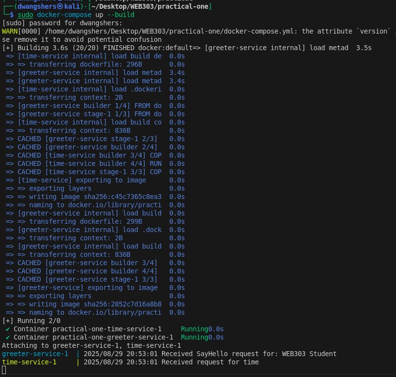
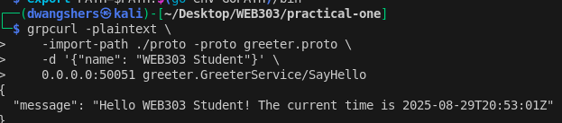

# [WEB303 Practical 1] gRPC Microservices Demo: Greeter and Time Services

This project demonstrates the implementation of a microservices architecture using Go, gRPC, and Docker Compose. It consists of two interconnected services that showcase inter-service communication patterns commonly used in distributed systems.

## Repository
### **Source Code**: The complete source code for this practical is available in the GitHub repository:  
#### **Repository Link**: https://github.com/DechenWangdraSherpa/web303-practical-one

This repository contains all the code and configuration files needed to run and test the microservices.

## Project Structure

```
.
├── docker-compose.yml
├── greeter-service/     # Primary service that handles greeting requests
│   ├── Dockerfile
│   ├── go.mod
│   ├── go.sum
│   └── main.go
├── proto/              # Shared protobuf definitions
│   ├── go.mod
│   ├── greeter.proto
│   ├── time.proto
│   └── gen/
│       └── proto/      # Generated gRPC code
└── time-service/       # Supporting service that provides time information
    ├── Dockerfile
    ├── go.mod
    ├── go.sum
    └── main.go
```

## Services

1. **Greeter Service** (Port 50051)

   - Primary service that handles client requests
   - Communicates with Time Service to include current time in greetings
   - Implements the `SayHello` RPC method

2. **Time Service** (Port 50052)
   - Supporting service that provides current time information
   - Used by Greeter Service to enhance the greeting message

## Technical Implementation

### Protocol Buffers

- Defined service contracts in `greeter.proto` and `time.proto`
- Generated Go code using protoc compiler
- Shared proto definitions between services

### Go Modules

Each service and the proto package are separate Go modules:

- `greeter-service/`: Main greeting service
- `time-service/`: Time provider service
- `proto/`: Shared protobuf definitions and generated code

### Docker Configuration

- Each service has its own Dockerfile
- Uses multi-stage builds to minimize final image size
- Services are orchestrated using Docker Compose

## Development Challenges & Solutions

1. **Module Dependencies**

   - Challenge: Initially faced issues with Go module paths and imports
   - Solution: Restructured the project to use proper module replacement and simplified import paths

2. **Docker Build Process**

   - Challenge: Initial builds failed due to module resolution
   - Solution: Updated Dockerfiles to use proper WORKDIR and improved build context

3. **gRPC Communication**
   - Challenge: Setting up proper service discovery between containers
   - Solution: Used Docker Compose networking and proper service naming

## Running and Testing the Project

### 1. Building and Starting Services

Run the following command to build and start both services:

```bash
docker-compose up --build
```



_Screenshot: Docker Compose building and running the services, showing successful container startup and inter-service communication logs_

### 2. Testing the Service

Test the service using grpcurl with the following command:

```bash
grpcurl -plaintext \
    -import-path ./proto -proto greeter.proto \
    -d '{"name": "WEB303 Student"}' \
    0.0.0.0:50051 greeter.GreeterService/SayHello
```



_Screenshot: gRPC request execution and response showing successful integration between the greeter and time services_

This demonstrates the successful communication between the greeter service and time service, as well as proper handling of the gRPC request.

## Testing Tools

- **grpcurl**: Command-line tool for interacting with gRPC services
  - Installation: `go install github.com/fullstorydev/grpcurl/cmd/grpcurl@latest`
  - Allows testing gRPC services without writing client code

## Project Dependencies

- Go 1.24.5
- Docker and Docker Compose
- Protocol Buffers
- gRPC
- Alpine Linux (base container image)

## Best Practices Implemented

1. **Containerization**

   - Multi-stage builds for smaller images
   - Proper base image selection
   - Clear separation of build and runtime environments

2. **Code Organization**

   - Clear separation of services
   - Shared proto definitions
   - Proper module structure

3. **Configuration**

   - Environment-based configuration
   - Docker Compose for service orchestration
   - Exposed ports configuration

4. **Error Handling**
   - Proper gRPC error codes
   - Logging for debugging
   - Graceful shutdown handlers
