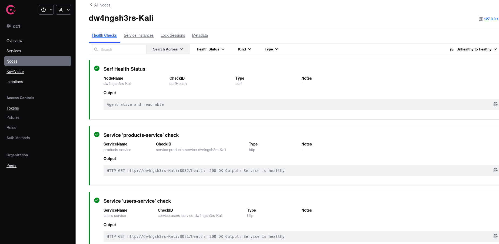
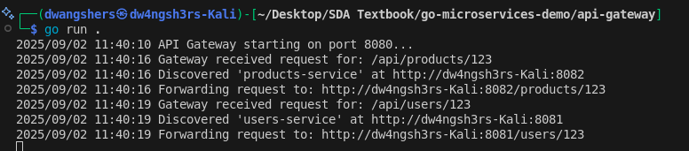

# Microservices Demo with Go and Consul

## Repository
### **Source Code**: The complete source code for this practical is available in the GitHub repository: 
#### GitHub Repository: [github.com/DechenWangdraSherpa/practical-two](https://github.com/DechenWangdraSherpa/web303-practical-two-go-microservice-demo)

## Project Overview

This project demonstrates a microservices architecture using Go and Consul for service discovery. It consists of three main components:

- An API Gateway that routes requests to appropriate services
- A Users Service that handles user-related requests
- A Products Service that handles product-related requests

## Architecture

The system uses the following architecture:

- **Service Registry (Consul)**: Acts as a central registry where services register themselves and can be discovered
- **API Gateway**: Routes incoming requests to the appropriate microservice based on the URL path
- **Microservices**: Independent services (Users and Products) that register with Consul and handle specific business functionality

## Project Structure

```
go-microservices-demo/
├── api-gateway/
│   └── main.go
└── services/
    ├── products-service/
    │   └── main.go
    └── users-service/
        └── main.go
```

## Implementation Steps

### 1. Project Setup

- Created the basic directory structure for the microservices architecture
- Set up separate Go modules for each service
- Implemented basic HTTP endpoints using the Chi router

### 2. Service Registry Configuration

- Installed Consul for service discovery
- Implemented service registration logic in both microservices
- Added health check endpoints for monitoring service status

### 3. API Gateway Development

- Created a dynamic reverse proxy for routing requests
- Implemented service discovery using Consul API
- Added path-based routing logic for different services

### 4. Service Implementation

- Developed the Users Service with basic user endpoints
- Created the Products Service with product-related endpoints
- Implemented health check endpoints for both services

## System Demonstration

### 1. Service Registration in Consul

Below is a screenshot of the Consul UI showing both services (Users and Products) successfully registered and reporting healthy status:



_Figure 1: Consul UI showing both services registered and healthy with green status indicators_

### 2. API Testing Results

The following screenshot shows the successful testing of both services through cURL commands:

 

_Figure 2: Terminal showing successful cURL requests to both Users and Products services_

### 3. API Gateway Routing

This screenshot demonstrates the API Gateway successfully receiving and routing requests:



_Figure 3: API Gateway terminal output showing successful request routing_

## Challenges Encountered and Solutions

### Main Challenge: Consul Connectivity Issues

#### Problem

When running Consul in Docker using the command:

```bash
docker run -d -p 8500:8500 --name=consul hashicorp/consul agent -dev -ui -client=0.0.0.0
```

The services were failing to register properly and showing as unhealthy in Consul.

#### Root Cause

The issue stemmed from networking complications between Docker and the host machine. When services running on the host machine tried to register with Consul running in Docker, there were connectivity issues due to how Docker handles networking and service discovery.

#### Solution

Running Consul directly on the host machine resolved the issue:

```bash
consul agent -dev
```

This approach worked because:

1. It eliminated the network boundary between Docker and the host
2. All services (Consul and microservices) were running in the same network space
3. Service registration and health checks could communicate directly

### Alternative Solutions

Potential approaches to resolve this issue:

1. **Host Machine Installation (Implemented Solution)**

   - Install Consul directly on the host machine
   - Run Consul as a local agent
   - Benefits: Simpler setup for development, direct network access

## Running the Project

1. Start Consul (on host machine):

   ```bash
   consul agent -dev
   ```

2. Start the Users Service:

   ```bash
   cd services/users-service
   go run .
   ```

3. Start the Products Service:

   ```bash
   cd services/products-service
   go run .
   ```

4. Start the API Gateway:
   ```bash
   cd api-gateway
   go run .
   ```

## Lessons Learned

1. Service discovery configuration needs careful consideration of network boundaries
2. Running services in different network contexts (Docker vs. host) can lead to connectivity issues
3. Development environment setup is crucial for proper service discovery functionality
4. Having a proper health check mechanism helps in identifying service registration issues

## Future Improvements

1. Implement Docker Compose for a fully containerized setup
2. Add load balancing for multiple service instances
3. Implement proper error handling and retries
4. Add monitoring and logging infrastructure
5. Implement security measures (authentication, authorization)
