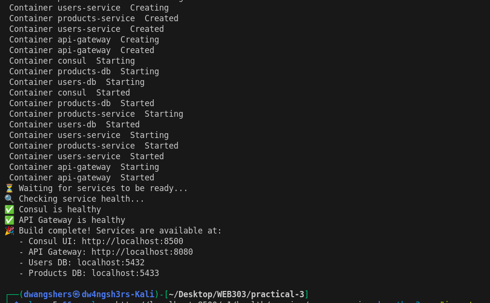
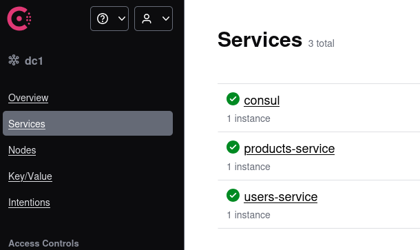
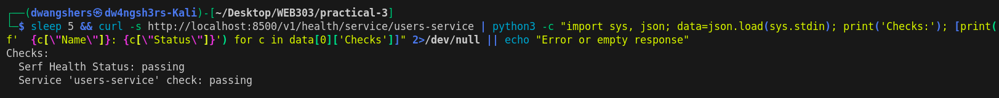
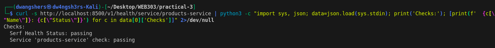
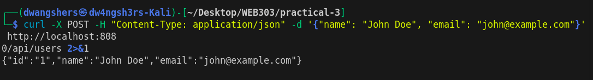
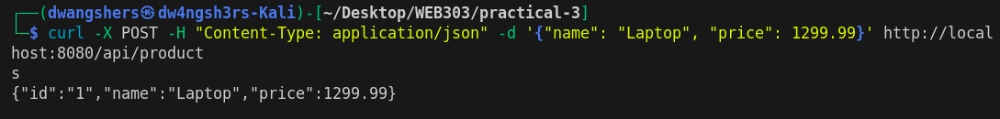
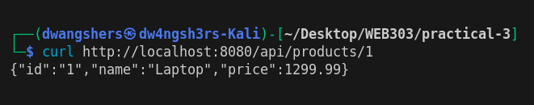

# [WEB303 Practical 3] : Microservices with gRPC and Service Discovery

## Objective
This practical implements a complete microservices ecosystem using gRPC for inter-service communication, PostgreSQL databases for data persistence, and Consul for service discovery. The system consists of an API Gateway, two independent microservices (users-service and products-service), and a composite endpoint demonstrating service orchestration.

## Architecture Overview
The implemented system follows a microservices architecture pattern:

* API Gateway (Port 8080): Single entry point for HTTP requests, translates REST to gRPC
* Consul (Port 8500): Service discovery and health monitoring
* Users Service (Port 50051): Manages user data with dedicated PostgreSQL database
* Products Service (Port 50052): Manages product data with dedicated PostgreSQL database
* Composite Endpoint: Aggregates data from multiple services in parallel

## Key Fixes Implemented
1. Service Discovery Integration
Problem: The original implementation used hardcoded service connections in the API Gateway, defeating the purpose of service discovery.

Solution: Implemented dynamic service discovery using Consul:

```bash
func (sd *ServiceDiscovery) getServiceConnection(serviceName string) (*grpc.ClientConn, error) {
    services, _, err := sd.consul.Health().Service(serviceName, "", true, nil)
    if err != nil {
        return nil, fmt.Errorf("failed to discover service %s: %w", serviceName, err)
    }
    // Connect to discovered service address
}
```

The API Gateway now queries Consul at runtime to locate healthy service instances.

2. Fixed Composite Endpoint
Problem: The aggregation endpoint wasn't properly utilizing service discovery.
Solution: Modified the /api/purchases/user/{userId}/product/{productId} endpoint to:

* Dynamically discover both services through Consul
* Execute parallel gRPC calls for better performance
* Handle service unavailability with proper error messages

## Build and Deployment
```
./scripts/build.sh
```


## Service Health Verification
### Consul Dashboard
Consul UI - Services Overview



### Health Check Validation
#### Users Service Health Checks

#### Products Service Health Checks


## API Endpoint Testing
### User Management Endpoints
#### Create User (POST)

#### Retrieve User (GET)


### Product Management Endpoints
#### Create Product (POST)

#### Retrieve Product (GET)


### Composite Endpoint (Service Aggregation)
#### Aggregated Purchase Data


Significance: This endpoint demonstrates:
* API Gateway successfully discovering both services via Consul
* Parallel gRPC calls to multiple services
* Data aggregation from independent microservices
* Proper inter-service communication

## Challenges and Solutions
### Challenge 1: Service Discovery Not Working
Issue: API Gateway initially had hardcoded connections bypassing Consul.
Solution: Refactored to implement ServiceDiscovery struct that queries Consul's health API for service locations before establishing gRPC connections.

### Challenge 2: Composite Endpoint Communication
Issue: Services were not properly communicating for data aggregation.
Solution:

Implemented proper service discovery for both users and products services
Added parallel goroutine execution for efficiency
Enhanced error handling for service unavailability

### Challenge 3: Health Check Configuration
Issue: Services weren't properly registering health status.
Solution: Added gRPC health check configuration in Consul registration with proper intervals and deregistration policies.

## Conclusion
This practical successfully implemented a complete microservices architecture addressing the core requirements of service discovery and inter-service communication. The API Gateway was refactored to use Consul for dynamic service discovery instead of hardcoded connections, eliminating tight coupling between services. The composite endpoint was fixed to properly aggregate data from both users-service and products-service through parallel gRPC calls, demonstrating efficient service orchestration. All services register themselves with Consul on startup and maintain health checks, enabling automatic service discovery and failover capabilities. The implementation showcases modern cloud-native patterns including containerization with Docker, gRPC for efficient communication, independent databases per service, and proper separation of concerns. Testing verified that all endpoints function correctly, with the composite endpoint successfully retrieving and combining data from multiple services in a single request. This architecture provides a scalable, maintainable foundation for distributed systems, demonstrating key concepts of microservices design including service autonomy, dynamic discovery, and effective inter-service communication patterns.