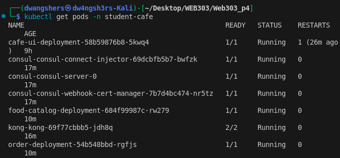
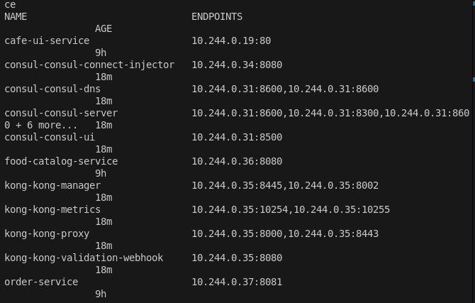
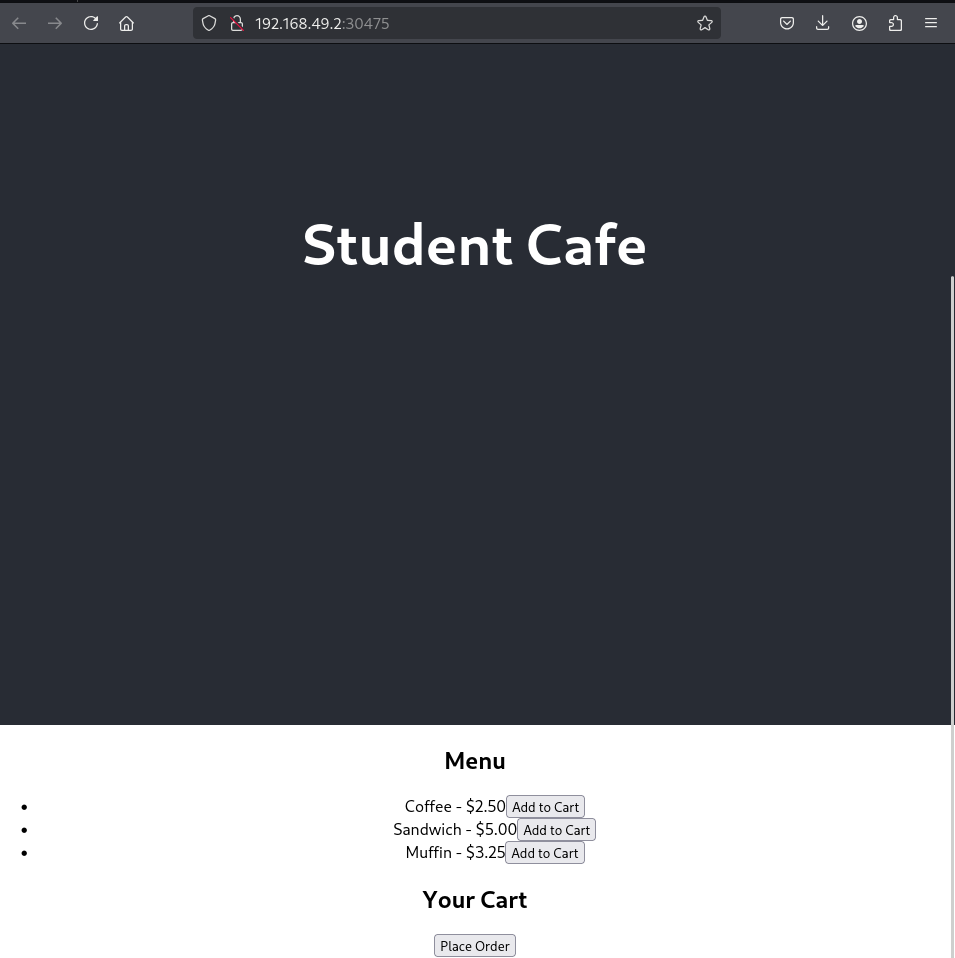
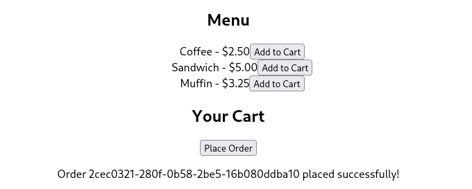
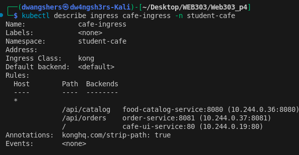

# Practical 4 Report: Kubernetes Microservices with Kong Gateway

## Repository
### **Source Code**: The complete source code for this practical is available in the GitHub repository:  
#### **Repository Link**: https://github.com/DechenWangdraSherpa/web303-practical-four

## Objective

Deploy a production-grade microservices application using Kubernetes, Kong API Gateway, and Consul service discovery. Implement and fix a student cafe ordering system with resilience patterns.

## Learning Outcomes

* Design microservices architecture using Go and React
* Configure Kubernetes deployments and service discovery with Consul
* Implement API gateway routing with Kong
* Debug and fix distributed system issues

## System Architecture

* Frontend: React.js SPA
* Backend Services: Go microservices (Food Catalog & Order)
* Infrastructure: Kubernetes, Kong API Gateway, Consul
* Communication: HTTP REST APIs with service discovery

## Implementation
### Services Deployed:

* food-catalog-service - Menu management (Port 8080)
* order-service - Order processing (Port 8081)
* cafe-ui - React frontend (Port 80)
* Consul - Service discovery
* Kong - API Gateway

#### Kong Routing:

```
/api/catalog → food-catalog-service:8080
/api/orders → order-service:8081
/ → cafe-ui-service:80
```

## Screenshots Evidence

### Kubernetes Pods Status
```
kubectl get pods -n student-cafe
```


### Services and Endpoints
```
kubectl get services -n student-cafe
kubectl get endpoints -n student-cafe  
```


### React Frontend - Menu Page


### Order Submission Success


### Kong Ingress Configuration

```
kubectl describe ingress cafe-ingress -n student-cafe
```


## Challenges & Solutions
### Issue: Order Submission Failure

Problem: Orders failing due to service communication issues

Solution: Debugged Consul discovery and fixed service endpoints

### Issue: Docker Build Compatibility

Solution: Updated Go versions and dependencies

## Testing & Validation
### Application successfully handles:

* Menu display from Food Catalog Service
* Order creation via Order Service
* Service discovery via Consul
* External access through Kong Gateway
* Resilience patterns implementation


## Conclusion

Successfully deployed a microservices architecture on Kubernetes with proper API gateway patterns. The system demonstrates production-ready service discovery, load balancing, and external routing while maintaining loose coupling between services.